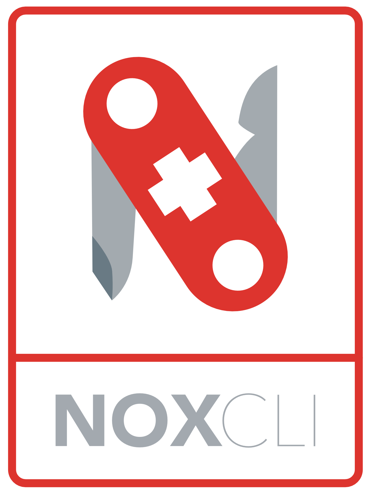
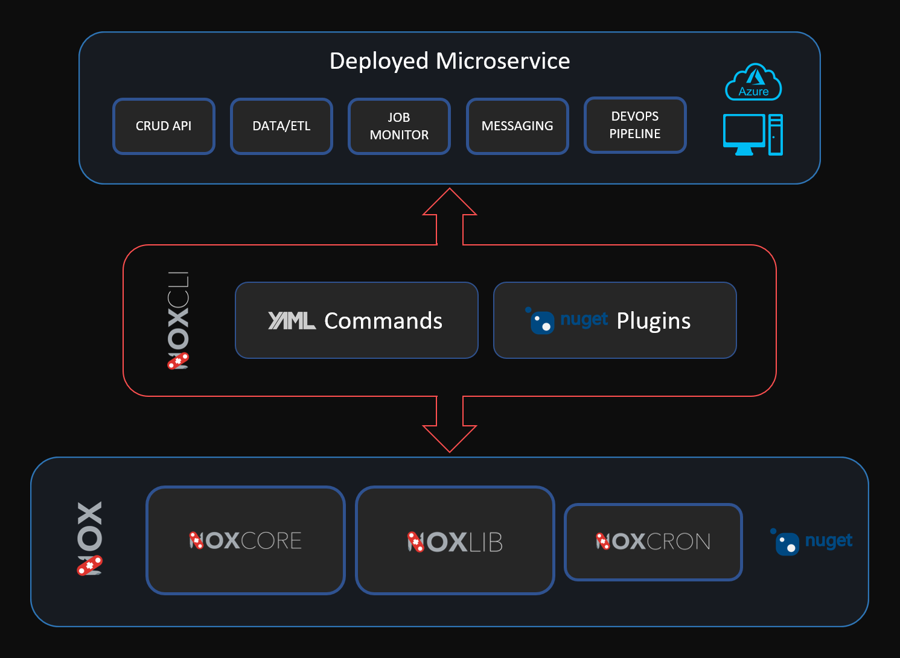
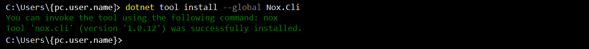
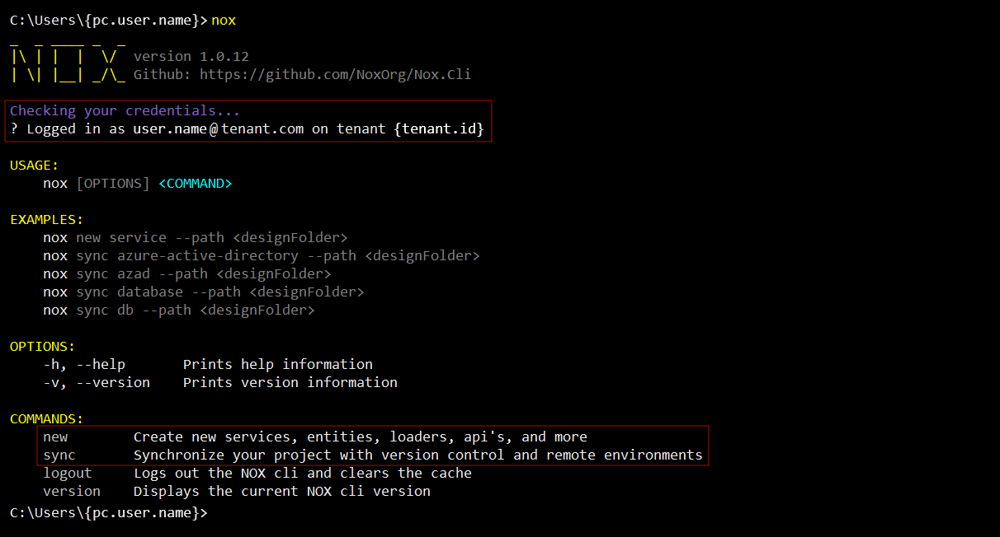
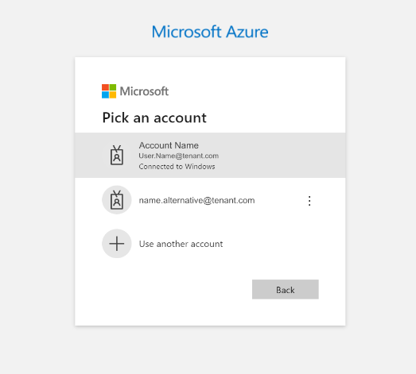
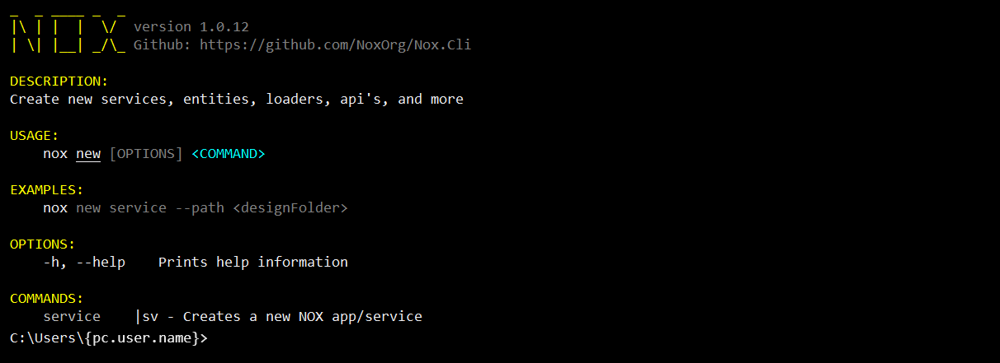
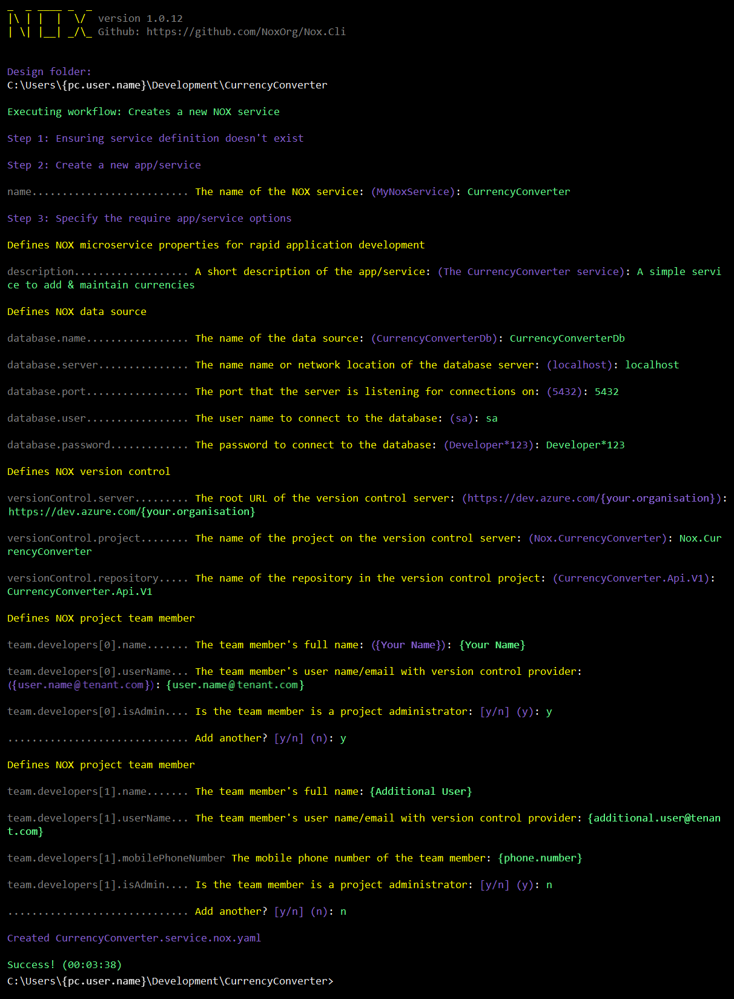
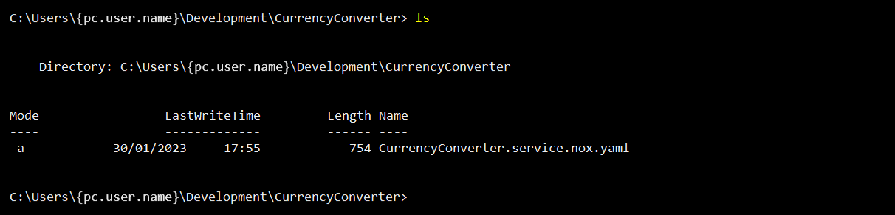
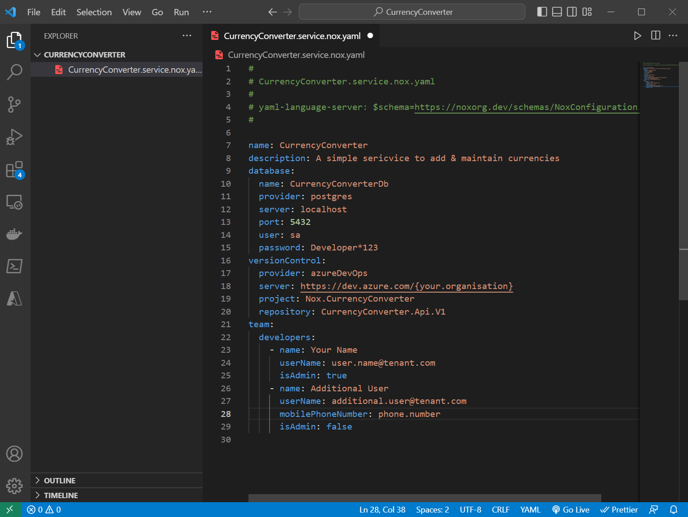

<!-- Improved compatibility of back to top link: See: https://github.com/othneildrew/Best-README-Template/pull/73 -->
<a name="readme-top"></a>
<!--
*** Thanks for checking out the Best-README-Template. If you have a suggestion
*** that would make this better, please fork the repo and create a pull request
*** or simply open an issue with the tag "enhancement".
*** Don't forget to give the project a star!
*** Thanks again! Now go create something AMAZING! :D
-->

<!-- PROJECT SHIELDS -->
<!--
*** I'm using markdown "reference style" links for readability.
*** Reference links are enclosed in brackets [ ] instead of parentheses ( ).
*** See the bottom of this document for the declaration of the reference variables
*** for contributors-url, forks-url, etc. This is an optional, concise syntax you may use.
*** https://www.markdownguide.org/basic-syntax/#reference-style-links
-->
[![Build][build-shield]][build-url]
[![Contributors][contributors-shield]][contributors-url]
[![Forks][forks-shield]][forks-url]
[![Stargazers][stars-shield]][stars-url]
[![Security][security-shield]][security-url]

<!-- PROJECT LOGO -->
<br />
<div align="center">
  <a href="https://github.com/noxorg/nox.cli">
    
  </a>
<!--
<h3 align="center">Nox</h3>
-->
  <p align="center">
    <br />
    Command line tool for supporting Nox projects
    <br />
    <br />
    <a href="https://noxorg.dev/"><strong>View the documentation »</strong></a>
    <br />
    <br />
    <a href="https://github.com/noxorg/nox.cli">View Demo</a>
    ·
    <a href="https://github.com/noxorg/nox.cli/issues">Report Bug</a>
    ·
    <a href="https://github.com/noxorg/nox.cli/issues">Request Feature</a>
  </p>
</div>
    <br />

<!-- ABOUT THE PROJECT -->
## About The Project
***
Nox.Cli is a companion tool that supports the core [Nox library](https://github.com/NoxOrg/Nox). Its *raison d'être* is to build upon Nox's strong efficiency focus by extending that vision to the entire Enterprise Software Roadmap. This includes fast-tracking of DevOps functions like deployment to multiple environments, setting up CI/CD pipelines and configuring resource permissions. This is achieved by integrating seamlessly with existing enterprise assets and services like Helm charts, Azure KeyVault and Active Directory.

<div align="center">
    
</div>
<br />

### Main Features
---

- Accelerate and simplify the development and deployment of enterprise-grade microservices
- Cross-platform implementation with support for Windows, Linux and MacOS
- Easy to install and run on developer/engineer desktop or integrate directly into DevOps pipeline
- Workflows use YAML-syntax and is based on GitHub Actions
- Self-documentation of project workflow to fast-track productivity of all team members that work on a project
- Open-source plugin-based architecture allows for using/customising existing actions or developing your own
- Users are identified based on Azure Login or other interactive authorisation service
- Input commands (workflows) can be project-specific or organisation-centric by way of a Tenant manifest maintained by DevOps
- Both project and Tenant KeyVaults are supported
- Can be used both for local development environment and DevOps pipeline
- Central management and deployment of common organisational scripts
- Automatically updates scripts and notifies developers of version updates
- Support secure remote task execution**


** Coming soon

### Component Diagram

<div align="center">
    
</div>
<br />


<p align="right">(<a href="#readme-top">back to top</a>)</p>

<!-- GETTING STARTED -->
## Getting Started

The section below will walk you though installation of the Nox.Cli tool as well as a sample project to illustrate how simple it is to create a basic microservice in a jiffy.
***
### Prerequisites
---

Make sure you have .NET 6 installed on your PC.
```powershell
PS> dotnet --version
6.0.404
```
### Install the Nox.Cli tool
---
The Nox.Cli tool is hosted on nuget.org [here](https://www.nuget.org/packages/Nox.Cli) and additional installation options are detailed there. The recommended installation method is outlined below: -
```powershell
PS> dotnet tool install --global Nox.Cli --version 1.0.12

PS> nox
```
The Nox.Cli tool is globally installed, and running it yeilds the following output: -

<div align="center">
    
</div>

Running Nox.Cli for the first time yields the following output: -

<div align="center">
    
    <br/>
    <br/>
</div>

> 💡 You may notice from the screenshot that if you are logged in to Azure it will automatically use these credentials. In the instance that you're not logged into Azure you will be redirected to Microsoft login screen in a browser: -

<div align="center">
    
    <br/>
    <br/>
</div>

> 💡 The second important thing to note is that apart from the `--version` and `--logout` commands, the additional commands listed above are dynamically added from the workflows folder in your local repository or from an remote organisation script repository hosted at `https://noxorg.dev/workflows/{tenant.id}/index.php`

## Building a Simple Microservice
---


We can now turn our attention to defining and deploying our first basic microservice. Let's build a simple currency service with all the expected CRUD endpoints to add & maintain the currencies of our choice.

### Defining the Service

Running the `Nox new` command outlines its usage options as seen below: -

<div align="center">
    
    <br/>
    <br/>
</div>

Let's create a folder for our project and run the `Nox new service` command from within the newly created folder: -

```powershell
PS> mkdir CurrencyConverter
PS> cd .\CurrencyConverter\
PS> Nox new service
```
A series of questions follows which will determine the initial configuration of the microservice. Upon completetion of the input, these options will be saved into the service configuration file called `{service.name}.service.nox.yaml`

<div align="center">
    
    <br/>
    <br/>
</div>

```powershell
PS> ls
```

As we can see, the sercvice configuration file is now present in our default project directory. Opening this file in a code editor of your choice will reveal configuration options that echoes your input from the interactive step preceding this.

<div align="center">
    
    <br/>
    <br/>
</div>

The YAML file is registered with [schema.org](https://schema.org/) so we get linting and auto-completion to ensure accuracy and speed in configuring our service. The schema used to describe our sample project can be viewed [here](https://noxorg.dev/schemas/NoxConfiguration.json).

<div align="center">
    
    <br/>
</div>

### Commissioning the Service

Now we have defined the service but all we have is a simple YAML file. Not much by way of a functioning microservice. Well this is where the magic really starts. We'll largelly turn our attention to the `Nox sync` command to read our service configuration file and go and build our actual microservice with all the options that we've specified.

```powershell
PS> Nox sync
```


<!-- CONTRIBUTING -->
## Contributing
***
Contributions are what make the open source community such an amazing place to learn, inspire, and create. Any contributions you make are **greatly appreciated**.

If you have a suggestion that would make this better, please fork the repo and create a pull request. You can also simply open an issue with the tag "enhancement".
Don't forget to give the project a star! Thanks again!

1. Fork the Project
2. Create your Feature Branch (`git checkout -b feature/AmazingFeature`)
3. Commit your Changes (`git commit -m 'Add some AmazingFeature'`)
4. Push to the Branch (`git push origin feature/AmazingFeature`)
5. Open a Pull Request

<!-- LICENSE -->
## License

Distributed under the MIT License. See `LICENSE.txt` for more information.

<p align="right">(<a href="#readme-top">back to top</a>)</p>


<!-- CONTACT -->
## Contact

Twitter: [@AndreSharpe72](https://twitter.com/AndreSharpe72) 

Project Link: [https://github.com/noxorg/nox.cli](https://github.com/noxorg/nox.cli)

<p align="right">(<a href="#readme-top">back to top</a>)</p>


<!-- ACKNOWLEDGMENTS -->
## Acknowledgments

* Nox was inspired and draws heavily from [Paul DeVito](https://github.com/pdevito3)'s very impressive [Wrapt](https://wrapt.dev/) project. Nox is essentially (a less feature-rich) Wrapt without the code generation and aims to keep developer code 100% separate from the framework, and imposes no constraints on application architechture.
* Nox would not have been possible without the many open-source projects that it draws from. The goal is to build on top of an already rich ecosystem of great libraries and tools like Microsoft's .NetCore, YamlDotNet, NewtonSoft.Json, Hangfire, Serilog, SqlKata, ETLBox, Entity Framework, MassTransit and others.

<p align="right">(<a href="#readme-top">back to top</a>)</p>


<!-- MARKDOWN LINKS & IMAGES -->
<!-- https://www.markdownguide.org/basic-syntax/#reference-style-links -->
[build-shield]: https://img.shields.io/github/actions/workflow/status/noxorg/nox.cli/nox_ci.yaml?branch=main&event=push&label=Build&style=for-the-badge
[build-url]: https://github.com/noxorg/nox.cli/actions/workflows/nox_ci.yaml?query=branch%3Amain
[contributors-shield]: https://img.shields.io/github/contributors/noxorg/nox.cli.svg?style=for-the-badge
[contributors-url]: https://github.com/noxorg/nox.cli/graphs/contributors
[forks-shield]: https://img.shields.io/github/forks/noxorg/nox.cli.svg?style=for-the-badge
[forks-url]: https://github.com/noxorg/nox.cli/network/members
[stars-shield]: https://img.shields.io/github/stars/noxorg/nox.cli.svg?style=for-the-badge
[stars-url]: https://github.com/noxorg/nox.cli/stargazers
[issues-shield]: https://img.shields.io/github/issues/noxorg/nox.cli.svg?style=for-the-badge
[issues-url]: https://github.com/noxorg/nox.cli/issues
[license-shield]: https://img.shields.io/github/license/noxorg/nox.cli.svg?style=for-the-badge
[license-url]: https://github.com/noxorg/nox.cli/blob/master/LICENSE.txt
[linkedin-shield]: https://img.shields.io/badge/-LinkedIn-black.svg?style=for-the-badge&logo=linkedin&colorB=555
[linkedin-url]: https://ch.linkedin.com/in/sharpeandre
[security-shield]: https://img.shields.io/sonar/vulnerabilities/NoxOrg_Nox/main?server=https%3A%2F%2Fsonarcloud.io&style=for-the-badge
[security-url]: https://sonarcloud.io/project/security_hotspots?id=NoxOrg_Nox
[product-screenshot]: images/goo-goo.gif
[ETLBox]: https://img.shields.io/badge/ETLBox-000000?style=for-the-badge
[ETLBox-url]: https://www.etlbox.net/
[React.js]: https://img.shields.io/badge/React-20232A?style=for-the-badge&logo=react&logoColor=61DAFB
[React-url]: https://reactjs.org/
[Bootstrap.com]: https://img.shields.io/badge/Bootstrap-563D7C?style=for-the-badge&logo=bootstrap&logoColor=white
[Bootstrap-url]: https://getbootstrap.com
[Hangfire.io]: https://img.shields.io/badge/Hangfire-0769AD?style=for-the-badge
[Hangfire-url]: https://www.hangfire.io/ 
[.NET]: https://img.shields.io/badge/.NET-512BD4?style=for-the-badge&logo=dotnet&logoColor=white
[.NET-url]: https://dotnet.microsoft.com/
[MassTransit]: https://img.shields.io/badge/MassTransit-0EA5E9?style=for-the-badge
[MassTransit-url]: https://masstransit-project.com/
[YamlDotNet]: https://img.shields.io/badge/YamlDotNet-8B0000?style=for-the-badge
[YamlDotNet-url]: https://github.com/aaubry/YamlDotNet
[AutoMapper]: https://img.shields.io/badge/AutoMapper-BE161D?style=for-the-badge
[AutoMapper-url]: https://automapper.org/
[FluentValidation]: https://img.shields.io/badge/FluentValidation-2980B9?style=for-the-badge
[FluentValidation-url]: https://docs.fluentvalidation.net/
