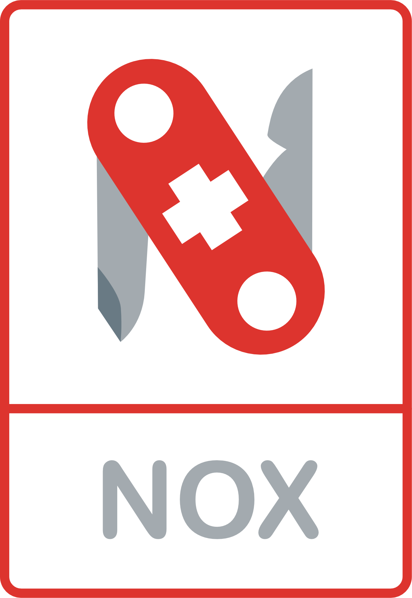

<!-- Improved compatibility of back to top link: See: https://github.com/othneildrew/Best-README-Template/pull/73 -->
<a name="readme-top"></a>
<!--
*** Thanks for checking out the Best-README-Template. If you have a suggestion
*** that would make this better, please fork the repo and create a pull request
*** or simply open an issue with the tag "enhancement".
*** Don't forget to give the project a star!
*** Thanks again! Now go create something AMAZING! :D
-->

<!-- PROJECT SHIELDS -->
<!--
*** I'm using markdown "reference style" links for readability.
*** Reference links are enclosed in brackets [ ] instead of parentheses ( ).
*** See the bottom of this document for the declaration of the reference variables
*** for contributors-url, forks-url, etc. This is an optional, concise syntax you may use.
*** https://www.markdownguide.org/basic-syntax/#reference-style-links
-->
[![Build][build-shield]][build-url]
[![Contributors][contributors-shield]][contributors-url]
[![Forks][forks-shield]][forks-url]
[![Stargazers][stars-shield]][stars-url]
[![Security][security-shield]][security-url]

<!-- PROJECT LOGO -->
<br />
<div align="center">
  <a href="https://github.com/noxorg/nox.cli">
    
  </a>
<!--
<h3 align="center">Nox</h3>
-->
  <p align="center">
    Command line tool for supporting Nox projects
    <br />
    <br />
    <a href="https://github.com/noxorg/nox.cli"><strong>View the documentation »</strong></a>
    <br />
    <br />
    <a href="https://github.com/noxorg/nox.cli">View Demo</a>
    ·
    <a href="https://github.com/noxorg/nox.cli/issues">Report Bug</a>
    ·
    <a href="https://github.com/noxorg/nox.cli/issues">Request Feature</a>
  </p>
</div>
    <br />

<!-- CONTRIBUTING -->
## Contributing
***
Contributions are what make the open source community such an amazing place to learn, inspire, and create. Any contributions you make are **greatly appreciated**.

If you have a suggestion that would make this better, please fork the repo and create a pull request. You can also simply open an issue with the tag "enhancement".
Don't forget to give the project a star! Thanks again!

1. Fork the Project
2. Create your Feature Branch (`git checkout -b feature/AmazingFeature`)
3. Commit your Changes (`git commit -m 'Add some AmazingFeature'`)
4. Push to the Branch (`git push origin feature/AmazingFeature`)
5. Open a Pull Request

### Hassle-free Development
---

The Nox project uses the [goo](https://goo.dev/) cross-platform development to make building and testing code hassle free.

```powershell
git clone https://github.com/noxorg/nox.cli.git

cd Nox

.\.goo.ps1 init
```
This should guide you through the pre-requisites needed to productively build and change Nox.

To view the project workflows, type:
```
.\.goo.ps1
```
and it'll display something like:


<p align="right">(<a href="#readme-top">back to top</a>)</p>
You should then be able to simply type `goo` anywhere in your project folder structure to return you to the project root and display these options.


<!-- LICENSE -->
## License

Distributed under the MIT License. See `LICENSE.txt` for more information.

<p align="right">(<a href="#readme-top">back to top</a>)</p>


<!-- CONTACT -->
## Contact

Twitter: [@AndreSharpe72](https://twitter.com/AndreSharpe72) 

Project Link: [https://github.com/noxorg/nox.cli](https://github.com/noxorg/nox.cli)

<p align="right">(<a href="#readme-top">back to top</a>)</p>


<!-- ACKNOWLEDGMENTS -->
## Acknowledgments

* Nox was inspired and draws heavily from [Paul DeVito](https://github.com/pdevito3)'s very impressive [Wrapt](https://wrapt.dev/) project. Nox is essentially (a less feature-rich) Wrapt without the code generation and aims to keep developer code 100% separate from the framework, and imposes no constraints on application architechture.
* Nox would not have been possible without the many open-source projects that it draws from. The goal is to build on top of an already rich ecosystem of great libraries and tools like Microsoft's .NetCore, YamlDotNet, NewtonSoft.Json, Hangfire, Serilog, SqlKata, ETLBox, Entity Framework, MassTransit and others.

<p align="right">(<a href="#readme-top">back to top</a>)</p>


<!-- MARKDOWN LINKS & IMAGES -->
<!-- https://www.markdownguide.org/basic-syntax/#reference-style-links -->
[build-shield]: https://img.shields.io/github/actions/workflow/status/noxorg/nox.cli/nox_ci.yaml?branch=main&event=push&label=Build&style=for-the-badge
[build-url]: https://github.com/noxorg/nox.cli/actions/workflows/nox_ci.yaml?query=branch%3Amain
[contributors-shield]: https://img.shields.io/github/contributors/noxorg/nox.cli.svg?style=for-the-badge
[contributors-url]: https://github.com/noxorg/nox.cli/graphs/contributors
[forks-shield]: https://img.shields.io/github/forks/noxorg/nox.cli.svg?style=for-the-badge
[forks-url]: https://github.com/noxorg/nox.cli/network/members
[stars-shield]: https://img.shields.io/github/stars/noxorg/nox.cli.svg?style=for-the-badge
[stars-url]: https://github.com/noxorg/nox.cli/stargazers
[issues-shield]: https://img.shields.io/github/issues/noxorg/nox.cli.svg?style=for-the-badge
[issues-url]: https://github.com/noxorg/nox.cli/issues
[license-shield]: https://img.shields.io/github/license/noxorg/nox.cli.svg?style=for-the-badge
[license-url]: https://github.com/noxorg/nox.cli/blob/master/LICENSE.txt
[linkedin-shield]: https://img.shields.io/badge/-LinkedIn-black.svg?style=for-the-badge&logo=linkedin&colorB=555
[linkedin-url]: https://ch.linkedin.com/in/sharpeandre
[security-shield]: https://img.shields.io/sonar/vulnerabilities/NoxOrg_Nox/main?server=https%3A%2F%2Fsonarcloud.io&style=for-the-badge
[security-url]: https://sonarcloud.io/project/security_hotspots?id=NoxOrg_Nox
[product-screenshot]: images/goo-goo.gif
[ETLBox]: https://img.shields.io/badge/ETLBox-000000?style=for-the-badge
[ETLBox-url]: https://www.etlbox.net/
[React.js]: https://img.shields.io/badge/React-20232A?style=for-the-badge&logo=react&logoColor=61DAFB
[React-url]: https://reactjs.org/
[Bootstrap.com]: https://img.shields.io/badge/Bootstrap-563D7C?style=for-the-badge&logo=bootstrap&logoColor=white
[Bootstrap-url]: https://getbootstrap.com
[Hangfire.io]: https://img.shields.io/badge/Hangfire-0769AD?style=for-the-badge
[Hangfire-url]: https://www.hangfire.io/ 
[.NET]: https://img.shields.io/badge/.NET-512BD4?style=for-the-badge&logo=dotnet&logoColor=white
[.NET-url]: https://dotnet.microsoft.com/
[MassTransit]: https://img.shields.io/badge/MassTransit-0EA5E9?style=for-the-badge
[MassTransit-url]: https://masstransit-project.com/
[YamlDotNet]: https://img.shields.io/badge/YamlDotNet-8B0000?style=for-the-badge
[YamlDotNet-url]: https://github.com/aaubry/YamlDotNet
[AutoMapper]: https://img.shields.io/badge/AutoMapper-BE161D?style=for-the-badge
[AutoMapper-url]: https://automapper.org/
[FluentValidation]: https://img.shields.io/badge/FluentValidation-2980B9?style=for-the-badge
[FluentValidation-url]: https://docs.fluentvalidation.net/
